# 惯性导航解算程序

[toc]

# 1  性质、目的和任务

## 1.1性质、目的和任务

## 1.2组织和分工情况

小组中共三人，分别为hj、pzl和myj，每人协作、独立进行了惯导解算程序的设计。

| **小组成员** | **分工**                                                 |
| ------------ | -------------------------------------------------------- |
| hj           | 解算程序的算法部分、可视化界面主体功能的实现             |
| pzl          | 界面换肤、图标、按钮换颜色和保存图片与日志功能、软件测试 |
| myj          | 说明帮助文档的撰写、程序介绍视频、软件测试               |

# 2  重点及内容

主要包含以下几个主要内容，分别为：1. 编程实现欧拉角、方向余弦阵、四元数以及等效旋转矢量之间的相互转换；2. 编程实现大地坐标与地心直角坐标相互转换；3. 编程实现IMR格式惯导数据的读取与解析；4. 编程实现地理坐标系下的姿态更新；5.编程实现地理坐标系下的速度和位置更新；6. 编程实现解析粗对准。 

## 2.1 欧拉角、方向余弦阵、四元数、等效旋转矢量转换

## 2.2 大地坐标与地心直角坐标相互转换

## 2.3 IMR格式惯导数据的读取与解析

IMR格式的数据读取即通过给定的IMR格式编写读写程序。其数据结构如下表所示：

| **IMR Header Struct Definition** |                  |             |                                                              |
| -------------------------------- | ---------------- | ----------- | ------------------------------------------------------------ |
| **Word**                         | **Size (bytes)** | **Type**    | **Description**                                              |
| szHeader                         | 8                | char[8]     | “$IMURAW0” – NULL terminated ASCII string                    |
| bIsIntelOrMotorola               | 1                | int8_t      | 0 = Intel (Little Endian), default  1 = Motorola (Big Endian) |
| dVersionNumber                   | 8                | double      | Inertial Explorer program version number (e.g. 8.80)         |
| bDeltaTheta                      | 4                | int32_t     | 0 = Data to follow will be read as scaled angular rates  1 = (default), data to follow will be read as delta  thetas, meaning angular increments (i.e. scale and multiply by *dDataRateHz* to  get degrees/second) |
| bDeltaVelocity                   | 4                | int32_t     | 0 = Data to follow will be read as scaled accelerations  1 = (default), data to follow will be read as delta  velocities, meaning velocity increments (i.e. scale and multiply by *dDataRateHz* to  get m/s2) |
| dDataRateHz                      | 8                | double      | The data rate of the IMU in Hz. e.g. 0.01 second data  rate is 100 Hz |
| dGyroScaleFactor                 | 8                | double      | If *bDeltaTheta* == 0, multiply the gyro  measurements by this to get degrees/second  If *bDeltaTheta* == 1, multiply the gyro  measurements by this to get degrees, then multiply by *dDataRateHz* to  get degrees/second |
| dAccelScaleFactor                | 8                | double      | If *bDeltaVelocity* == 0, multiply the  accel measurements by this to get m/s2  If *bDeltaVelocity* == 1, multiply the  accel measurements by this to get m/s, then multiply by *dDataRateHz* to  get m/s2 |
| iUtcOrGpsTime                    | 4                | int32_t     | Defines the time tags as GPS or UTC seconds of the week  0 = Unknown, will default to GPS  1 = Time tags are UTC seconds of week  2 = Time tags are GPS seconds of week |
| iRcvTimeOrCorrTime               | 4                | int32_t     | Defines whether the time tags are on the nominal top of  the second or are corrected for receiver time bias  0 = Unknown, will default to corrected time  1 = Time tags are top of the second  2 = Time tags are corrected for receiver clock bias |
| dTimeTagBias                     | 8                | double      | If you have a known bias between your GPS and IMU time  tags enter it here |
| szImuName                        | 32               | char[32]    | Name of the IMU being used                                   |
| reserved1                        | 4                | uint8_t[4]  | Reserved for future use                                      |
| szProgramName                    | 32               | char[32]    | Name of calling program                                      |
| tCreate                          | 12               | time_type   | Creation time of file                                        |
| bLeverArmValid                   | 1                | bool        | True if lever arms from IMU to primary GNSS antenna are  stored in this header |
| lXoffset                         | 4                | int32_t     | X value of the lever arm, in millimeters                     |
| lYoffset                         | 4                | int32_t     | Y value of the lever arm, in millimeters                     |
| lZoffset                         | 4                | int32_t     | Z value of the lever arm, in millimeters                     |
| Reserved[354]                    | 354              | int8_t[354] | Reserved for future use                                      |

 

The single header, which is a total of 512 bytes long, is followed by a structure of the following type for each IMU measurement epoch:

| **IMR Record Struct Definition** |          |          |                                                |
| -------------------------------- | -------- | -------- | ---------------------------------------------- |
| **Word**                         | **Size** | **Type** | **Description**                                |
| Time                             | 8        | double   | Time of the  current measurement               |
| gx                               | 4        | int32_t  | Scaled gyro  measurement about the IMU X-axis  |
| gy                               | 4        | int32_t  | Scaled gyro  measurement about the IMU Y-axis  |
| gz                               | 4        | int32_t  | Scaled gyro  measurement about the IMU Z-axis  |
| ax                               | 4        | int32_t  | Scaled accel  measurement about the IMU X-axis |
| ay                               | 4        | int32_t  | Scaled accel  measurement about the IMU Y-axis |
| az                               | 4        | int32_t  | Scaled accel  measurement about the IMU Z-axis |

 

## 2.4 地理坐标系下的姿态更新

## 2.5 地理坐标系下的速度和位置更新

## 2.6 解析粗对准

# 3  解算程序设计思路原理

## 3.1编译环境概述：

1. 操作系统: Windows 10专业版 19042.685

2. 主要IDE: Microsoft Visual Studio 2019 + Qt Creator 4.11.1(Community)

3. 程序语言：C++ 11

4. 其他实现IDE: PyCharm Professional 2020.3.1, MATLAB 2020a

## 3.2程序组织架构：

算法的主要实现结构如下图所示：

 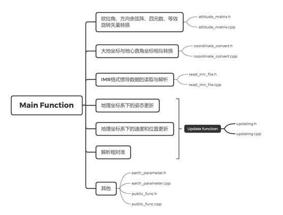

## 3.2代码设计：

### 3.2.1姿态转换矩阵

欧拉角类的类架构如下所示：

 

 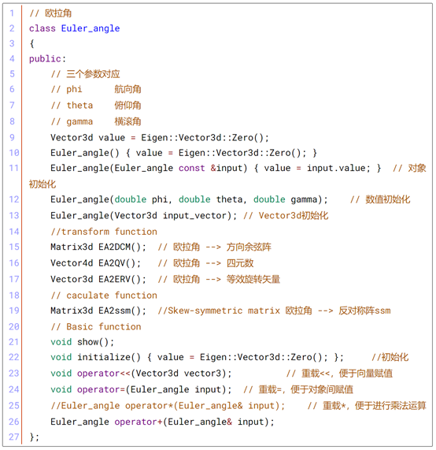

方形余弦阵类架构的如下所示：

 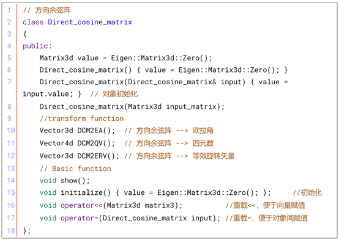

四元数类的架构如下所示：

 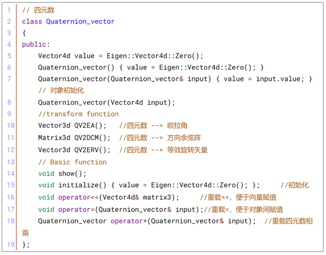

等效旋转矢量类的架构如下所示：

 

### 3.2.2坐标转换

坐标转化的相应函数如下所示：

 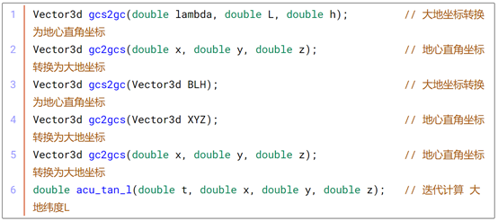

### 3.2.3 IMR文件的读取与解析

IMR 文件头的组织架构

 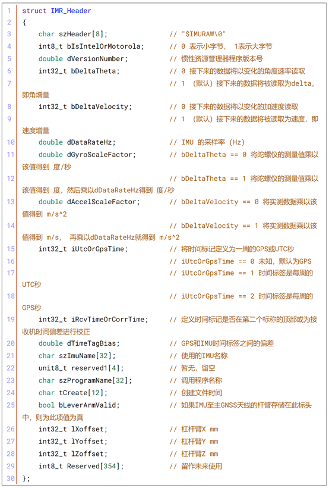

IMR 数据结构：

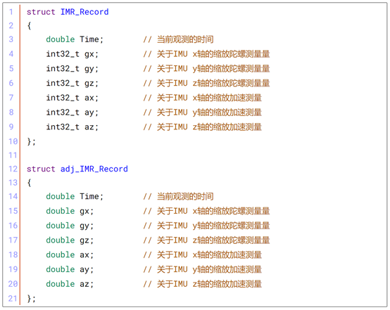

IMR数据读取结构

 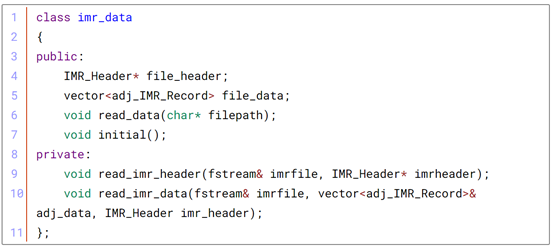

 

### 3.2.4 姿态、速度、位置更新

 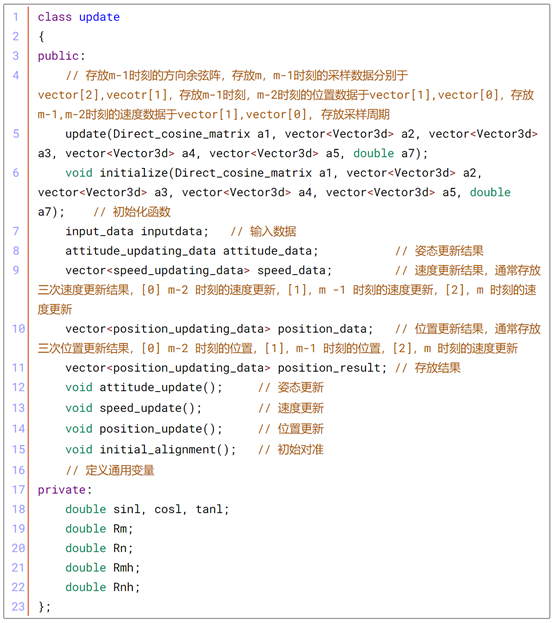

# 4  软件概述及功能介绍

## 4.1 概述

1. 操作系统：Windows 10

2. IDE：Microsoft Visual Studio 2015

3. 程序语言：C++ 11

4. 主程序文件构成：GPSsolving.h GPSsolving.cpp question.cpp

矩阵类文件构成：Matrix.h Matrix.cpp

## 4.2软件功能概述

软件功能如下图所示：

 

本惯性导航数据解算软件主要基于Qt开发，主要实现了下述的一些功能：

1. 在数据解算方面，软件实现了IMR数据文件的解算读取、初始姿态数据的保存、惯导数据的解算（其中包括了欧拉角、方形余弦阵、四元数、等效旋转矢量的转换、大地坐标与地心直角坐标相互转换、地理坐标系的姿态更新、速度更新、位置更新、解析粗对准等功能）。

2. 在数据的存储方面、主要实现了解算数据的存储、打开、绘图功能、绘图结果的存储、软件日志的存储。

3. 在软件功能方面，软件实现了日志功能、撰写了相应的帮助文档、通过邮件联系作者以及切换软件界面视图等功能。

# 5  程序运行介绍

1. IMR文件读取

 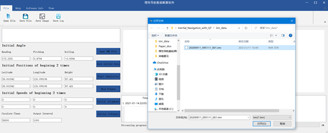

2. 初始解算数据保存

 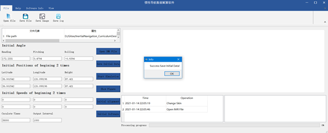

3. 进行粗对准

 

4. 解算惯导数据

 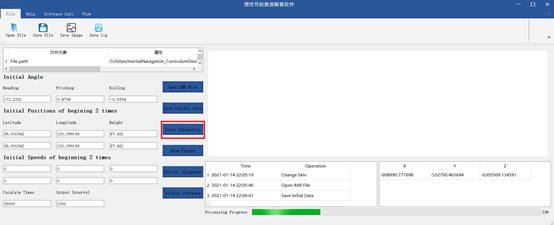

5. 绘图显示

 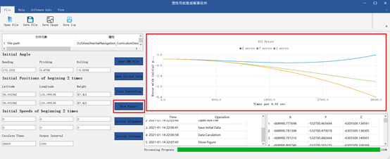

6. 软件初始化

 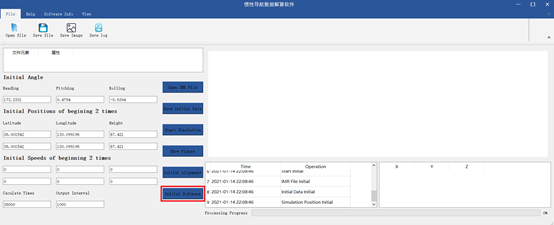

7. 数据保存

 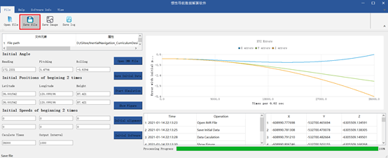

8. 数据导入

 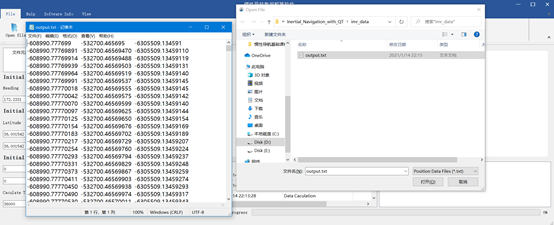

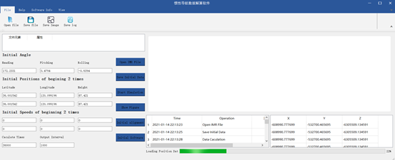

9. 保存图片显示与程序日志

 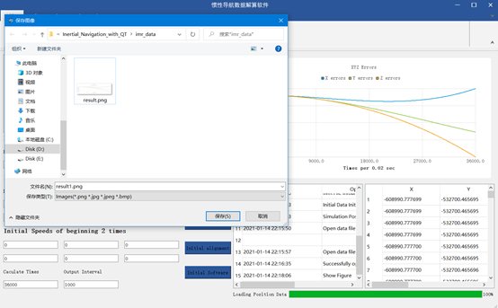

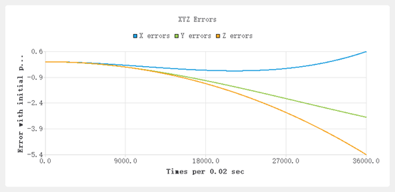

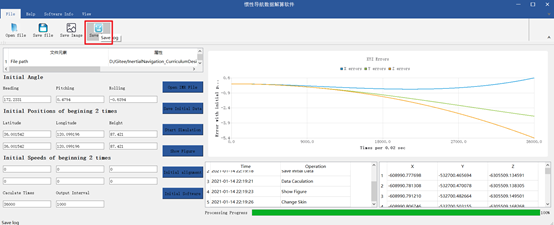

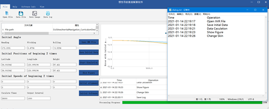

10. 程序帮助文档与界面切换

 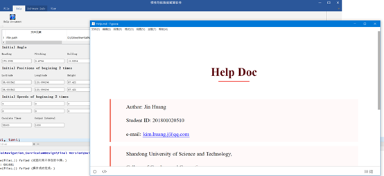

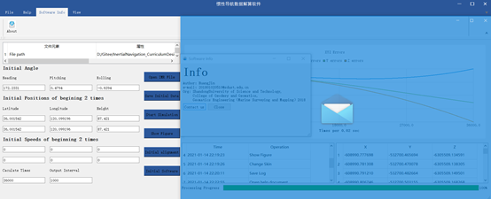

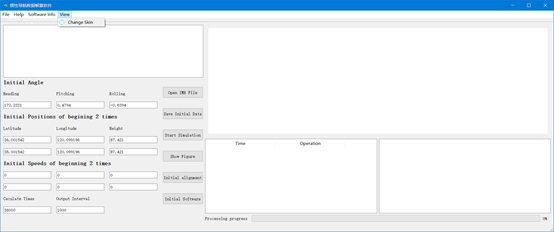

